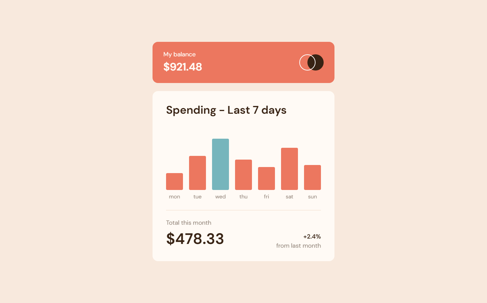

# Frontend Mentor - Expenses chart component solution

This is a solution to the [Expenses chart component challenge on Frontend Mentor](https://www.frontendmentor.io/challenges/expenses-chart-component-e7yJBUdjwt). Frontend Mentor challenges help you improve your coding skills by building realistic projects. 

## Table of contents

- [Overview](#overview)
  - [The challenge](#the-challenge)
  - [Screenshot](#screenshot)
  - [Links](#links)
- [My process](#my-process)
  - [Built with](#built-with)
  - [What I learned](#what-i-learned)
  - [Continued development](#continued-development)
  - [Useful resources](#useful-resources)
- [Author](#author)

## Overview

### The challenge

Users should be able to:

- View the bar chart and hover over the individual bars to see the correct amounts for each day
- See the current day’s bar highlighted in a different colour to the other bars
- View the optimal layout for the content depending on their device’s screen size
- See hover states for all interactive elements on the page
- **Bonus**: Use the JSON data file provided to dynamically size the bars on the chart

### Screenshot



### Links

- HTML Solution URL: [HTML](https://github.com/JustANipple/expenses-chart-component/blob/master/index.html)
- CSS Solution URL: [CSS](https://github.com/JustANipple/expenses-chart-component/blob/master/styles/css/main.css)
- JavaScript Solution URL: [JS](https://github.com/JustANipple/expenses-chart-component/blob/master/script/script.js)
- Live Site URL: [LIVE](https://justanipple.github.io/expenses-chart-component/)

## My process

### Built with

- Semantic HTML5 markup
- CSS custom properties
- Flexbox
- Mobile-first workflow
- JavaScript
- SCSS components

### What I learned

Playing with chart bars was fun and made me learn a lot about how to size them based on what info the data.json contains
I think i've made a good use of async and await too, but it took a while before making the code work the right way
I've made use of math and used a proportion to make bars the right height based on their number (in this case, amount of dollars)

To see how you can add code snippets, see below:

```js
//check the highest number in the data for the proportion
const highest = highNumber(amounts);

const barsArr = document.querySelectorAll(".container_bar");
//proportion --> highest : 9.5rem = number : ? --> 9.5 * number / highest
for(let i = 0; i < barsArr.length; i++) {
    barsArr[i].style.height = maxHeight * amounts[i].amount / highest + "rem";
}
```

### Continued development

Premises are still a tricky thing. Even i had to use a local JSON, making a request to the file was still a challenge
I will work more on APIs from now on

### Useful resources

- [Using JSON](https://developer.mozilla.org/en-US/docs/Learn/JavaScript/Objects/JSON) - With this guide i learnt to use JSON files for my chart

## Author

- Frontend Mentor - [@JustANipple](https://www.frontendmentor.io/profile/JustANipple)
